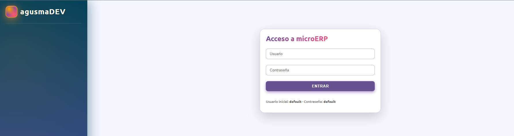
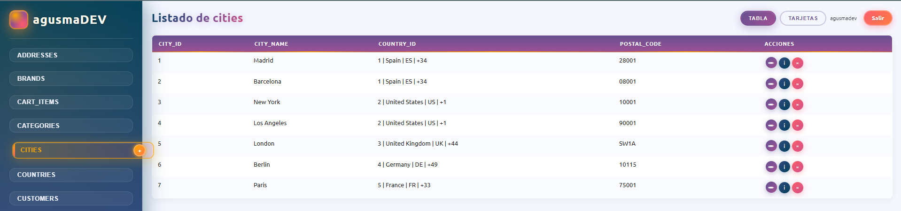
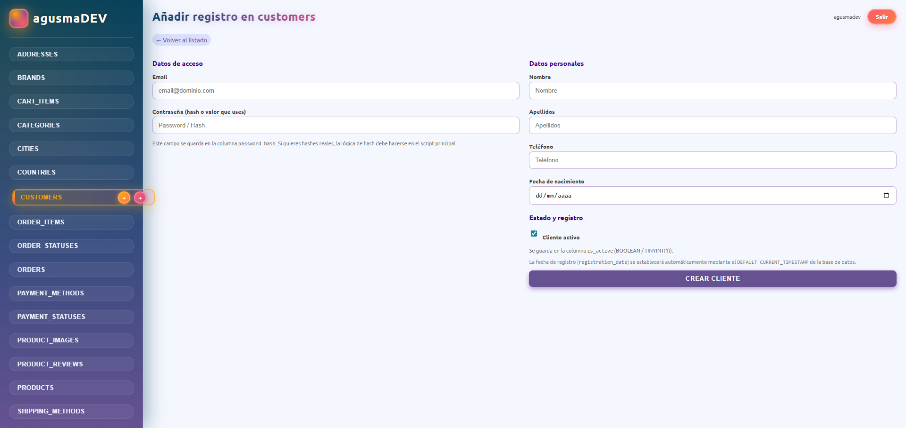
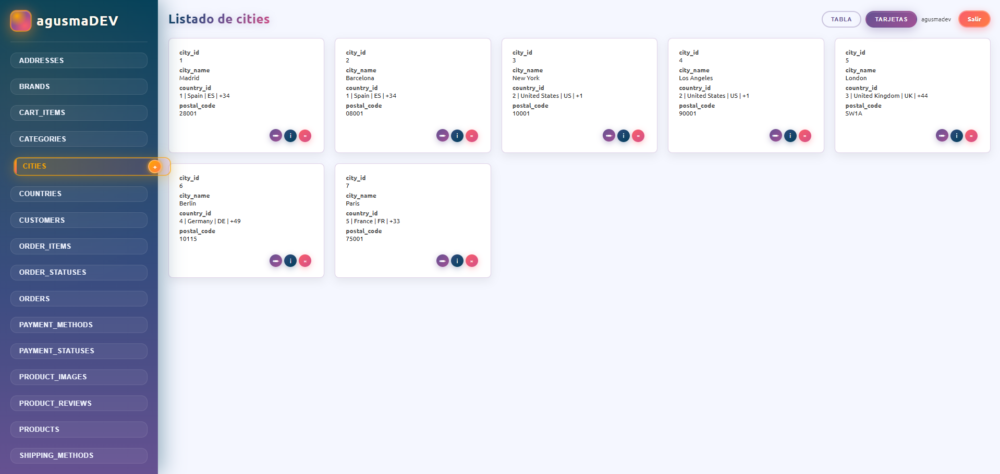

# 🚀 microERP

<div align="center">
  
  
  
  
</div>

<div align="center">
  <h3>Sistema ERP Inteligente Auto-Generado</h3>
  <p>Un sistema de gestión empresarial que genera automáticamente interfaces CRUD completas a partir de tu esquema de base de datos MySQL</p>
</div>

---

## 📋 Tabla de Contenidos

- [Características](#-características)
- [Demo Visual](#-demo-visual)
- [Requisitos](#-requisitos)
- [Instalación](#-instalación)
- [Configuración](#️-configuración)
- [Uso](#-uso)
- [Estructura del Proyecto](#-estructura-del-proyecto)
- [Plantillas Personalizadas](#-plantillas-personalizadas)
- [Funcionalidades Avanzadas](#-funcionalidades-avanzadas)
- [Tecnologías Utilizadas](#-tecnologías-utilizadas)
- [Contribuir](#-contribuir)
- [Licencia](#-licencia)
- [Autor](#-autor)

---

## ✨ Características

### 🎯 Generación Automática de Interfaces
- **CRUD Completo**: Crea, lee, actualiza y elimina registros sin escribir código
- **Detección Inteligente**: Analiza automáticamente el esquema de tu base de datos
- **Relaciones FK**: Detecta y muestra claves foráneas con selectores dinámicos
- **Tipos de Datos**: Renderiza controles apropiados para cada tipo de columna

### 🎨 Interfaz Moderna y Responsive
- **Diseño Gradiente**: Interfaz atractiva con degradados vibrantes (indigo, naranja, rosa)
- **Animaciones Fluidas**: Transiciones suaves y efectos hover profesionales
- **Mobile-First**: Totalmente responsive para dispositivos móviles
- **Modo Tarjetas**: Vista de tarjetas estilizadas para una mejor visualización

### 📊 Visualización de Datos
- **Gráficos Integrados**: Generación automática de gráficos donut (pie charts) en SVG
- **Tablas Relacionales**: Muestra información completa de relaciones FK en tablas
- **Informes Personalizados**: Sistema de reportes con consultas SQL dinámicas
- **Exportación**: Visualización optimizada para impresión y exportación

### 🔐 Seguridad
- **Sistema de Login**: Autenticación por sesión PHP
- **Protección CSRF**: Validación de operaciones críticas
- **Escape de Datos**: Protección contra inyección SQL con `mysqli_real_escape_string`
- **Sesiones Seguras**: Manejo apropiado de sesiones PHP

### 🛠️ Plantillas Personalizables
- **Templates PHP**: Crea formularios personalizados por tabla en `templates/`
- **Dos Modos de Añadir**: Formulario genérico o template personalizado
- **Estilos Propios**: Cada template puede tener su propio CSS
- **Reutilizable**: Variables predefinidas disponibles en cada template

---

## 🖼️ Demo Visual

### Pantalla de Login
> _Interfaz de autenticación con gradientes modernos_




### Dashboard Principal | Gráficos y Reportes
> _Vista de tablas con navegación lateral y acciones rápidas_



### Formularios Personalizados
> _Ejemplo de formulario con template personalizado para clientes_



### Vista de Tarjetas
> _Visualización moderna de registros en formato card_



### Gráficos y Reportes
> _Gráficos donut generados automáticamente con leyenda interactiva_


---

## 📦 Requisitos

- **PHP** >= 7.4
- **MySQL** >= 5.7 o **MariaDB** >= 10.2
- **Servidor Web**: Apache, Nginx, o PHP built-in server
- **Extensiones PHP**:
  - `mysqli`
  - `session`

### Recomendado para Desarrollo Local
- **XAMPP** (incluye Apache + PHP + MySQL)
- **WAMP** (Windows)
- **MAMP** (macOS)
- **Laragon** (Windows)

---

## 🚀 Instalación

### Opción 1: Clonar desde GitHub

```bash
# Clonar el repositorio
git clone https://github.com/agusmadev/microERP.git

# Navegar al directorio
cd microERP
```

### Opción 2: Descarga Directa

1. Descarga el archivo ZIP desde [Releases](https://github.com/agusmadev/microERP/releases)
2. Extrae el contenido en tu servidor web (ej: `htdocs/microERP`)

### Configuración del Servidor Web

#### Con XAMPP/WAMP/MAMP
Coloca el proyecto en la carpeta `htdocs` o `www`:
```
C:\xampp\htdocs\microERP\     (Windows)
/Applications/XAMPP/htdocs/microERP/   (macOS)
/opt/lampp/htdocs/microERP/   (Linux)
```

#### Con PHP Built-in Server
```bash
php -S localhost:8000 -t .
```

---

## ⚙️ Configuración

### 1. Crear Base de Datos

Crea tu base de datos MySQL con la estructura que necesites. Ejemplo:

```sql
CREATE DATABASE mi_empresa_db;

USE mi_empresa_db;

CREATE TABLE clientes (
    id_cliente INT AUTO_INCREMENT PRIMARY KEY,
    email VARCHAR(100) UNIQUE NOT NULL,
    hash_contrasena VARCHAR(255) NOT NULL,
    nombre VARCHAR(50) NOT NULL,
    apellido VARCHAR(50) NOT NULL,
    telefono VARCHAR(20),
    fecha_nacimiento DATE,
    fecha_registro DATETIME DEFAULT CURRENT_TIMESTAMP,
    ultimo_acceso DATETIME,
    esta_activo TINYINT(1) DEFAULT 1
);

CREATE TABLE pedidos (
    id_pedido INT AUTO_INCREMENT PRIMARY KEY,
    id_cliente INT NOT NULL,
    fecha_pedido DATETIME DEFAULT CURRENT_TIMESTAMP,
    total DECIMAL(10,2) NOT NULL,
    estado ENUM('pendiente', 'procesando', 'enviado', 'entregado') DEFAULT 'pendiente',
    FOREIGN KEY (id_cliente) REFERENCES clientes(id_cliente)
);
```

### 2. Configurar Credenciales

Edita el archivo `index.php` (líneas 5-12):

```php
// Parámetros de conexión a la base de datos
$db_host = "localhost";
$db_name = "mi_empresa_db";      // ← Nombre de tu base de datos
$db_user = "root";                // ← Tu usuario MySQL
$db_pass = "";                    // ← Tu contraseña MySQL

// Credenciales de login del ERP
$usuario_valido     = "admin";    // ← Usuario para acceder al ERP
$contrasena_valida  = "admin123"; // ← Contraseña para acceder al ERP
```

⚠️ **Nota de Seguridad**: En producción, usa variables de entorno o archivos de configuración externos.

### 3. Acceder al Sistema

Abre tu navegador y visita:
```
http://localhost/microERP/
```

Credenciales de acceso (por defecto):
- **Usuario**: `admin`
- **Contraseña**: `admin123`

---

## 🎯 Uso

### Navegación Básica

1. **Login**: Ingresa con las credenciales configuradas
2. **Seleccionar Tabla**: Haz clic en cualquier tabla del menú lateral
3. **Ver Registros**: Los registros se muestran automáticamente en formato tabla/tarjetas
4. **Añadir Registro**: Usa el botón `+` junto al nombre de la tabla

### Operaciones CRUD

#### ➕ Crear (INSERT)
- Clic en el botón `+` (naranja o verde según el tipo)
- Completa el formulario
- Los campos con FK muestran selectores con datos relacionados
- Envía el formulario

#### 📝 Editar (UPDATE)
- Clic en el ícono de lápiz `✏️` (morado) junto al registro
- Modifica los campos necesarios
- Guarda los cambios

#### 🗑️ Eliminar (DELETE)
- Clic en el ícono de papelera `🗑️` (rojo) junto al registro
- Confirma la eliminación
- El sistema verifica restricciones de FK antes de eliminar

#### 📊 Reportar
- Clic en el ícono de gráfico `📊` (azul oscuro)
- Genera automáticamente gráficos y estadísticas de la tabla

### Vistas Disponibles

| Vista | Descripción |
|-------|-------------|
| **Tabla Estándar** | Lista tradicional con filas y columnas |
| **Tarjetas** | Cards modernas con información estructurada |
| **Reportes** | Gráficos donut con leyendas interactivas |

---

## 📁 Estructura del Proyecto

```
microERP/
│
├── index.php                    # Archivo principal (todo en uno)
├── README.md                    # Documentación (este archivo)
│
├── templates/                   # Plantillas personalizadas por tabla
│   ├── clientes.php            # Template para tabla 'clientes'
│   ├── customers.php           # Template para tabla 'customers'
│   ├── orders.php              # Template para tabla 'orders'
│   └── pedidos.php             # Template para tabla 'pedidos'
│
└── docs/                        # (Opcional) Documentación adicional
    └── images/                  # Capturas de pantalla para README
        ├── login.png
        ├── dashboard.png
        ├── custom-form.png
        ├── card-view.png
        └── charts.png
```

### Archivo Principal: `index.php`

El sistema está construido en un único archivo PHP que contiene:

- **Lógica de Autenticación** (líneas 1-35)
- **Conexión a Base de Datos** (líneas 36-42)
- **Funciones Helper** (líneas 43-350):
  - Detección de claves foráneas
  - Metadatos de columnas
  - Renderizado de controles de formulario
  - Generación de gráficos SVG
- **Estilos CSS Embebidos** (líneas 351-1050)
- **Estructura HTML** (líneas 1051-1703):
  - Navegación lateral
  - Operaciones CRUD
  - Renderizado de vistas

---

## 🎨 Plantillas Personalizadas

### ¿Qué son las Plantillas?

Las plantillas permiten crear formularios completamente personalizados para tablas específicas, con tu propio HTML, CSS y lógica de validación.

### Crear una Plantilla

1. Crea un archivo en `templates/` con el nombre exacto de tu tabla:
   ```
   templates/nombre_tabla.php
   ```

2. El sistema detectará automáticamente la plantilla y mostrará **dos botones `+`**:
   - **Naranja** (genérico): Formulario auto-generado
   - **Verde** (template): Tu formulario personalizado

### Variables Disponibles

Todas las plantillas tienen acceso a:

| Variable | Tipo | Descripción |
|----------|------|-------------|
| `$tabla` | string | Nombre de la tabla actual |
| `$columnMeta` | array | Metadatos de todas las columnas |
| `$foreignKeys` | array | Información de claves foráneas |
| `$primaryKey` | string | Nombre de la columna PK |
| `$conexion` | mysqli | Conexión activa a la BD |
| `$template_mode` | string | `'insert'` o `'update'` |
| `$fila_actual` | array/null | Datos del registro (solo en UPDATE) |
| `$form_action` | string | URL para el `<form action="">` |

### Ejemplo de Plantilla

```php
<?php
// templates/productos.php

$is_update = isset($template_mode) && $template_mode === 'update';

if ($is_update) {
    $nombre = $fila_actual['nombre'] ?? '';
    $precio = $fila_actual['precio'] ?? '';
} else {
    $nombre = $_POST['nombre'] ?? '';
    $precio = $_POST['precio'] ?? '';
}
?>

<style>
.form-productos {
    background: linear-gradient(135deg, #667eea 0%, #764ba2 100%);
    padding: 30px;
    border-radius: 15px;
    color: white;
}
</style>

<form action="<?php echo htmlspecialchars($form_action); ?>" 
      method="POST" 
      class="form-productos">
    
    <h3>Añadir Producto</h3>
    
    <label>Nombre del Producto</label>
    <input type="text" name="nombre" value="<?php echo htmlspecialchars($nombre); ?>" required>
    
    <label>Precio (€)</label>
    <input type="number" name="precio" value="<?php echo htmlspecialchars($precio); ?>" step="0.01" required>
    
    <input type="submit" value="<?php echo $is_update ? 'Actualizar' : 'Crear Producto'; ?>">
</form>
```

---

## 🔥 Funcionalidades Avanzadas

### 1. Detección Automática de Tipos

El sistema renderiza controles apropiados según el tipo de columna:

| Tipo MySQL | Control HTML |
|------------|--------------|
| `VARCHAR`, `TEXT` | `<input type="text">` |
| `INT`, `BIGINT` | `<input type="number" step="1">` |
| `DECIMAL`, `FLOAT` | `<input type="number" step="any">` |
| `DATE` | `<input type="date">` |
| `DATETIME` | `<input type="datetime-local">` |
| `TIME` | `<input type="time">` |
| `ENUM`, `SET` | `<select>` con opciones |
| `TINYINT(1)` | `<input type="checkbox">` |

### 2. Relaciones de Claves Foráneas

Cuando una columna tiene una FK:
- En **formularios**: Se muestra un `<select>` con los registros de la tabla relacionada
- En **tablas**: Se muestra la información completa del registro relacionado (no solo el ID)

### 3. Gráficos Dinámicos

El botón "Reportar" genera automáticamente:
- **Gráfico Donut (Pie Chart)** en SVG puro
- **Leyenda Interactiva** con colores vibrantes
- **Totales y Porcentajes** calculados
- **Responsivo** y optimizado para impresión

### 4. Validaciones de Integridad

Antes de eliminar un registro, el sistema:
1. Verifica si hay tablas que lo referencian (FK entrantes)
2. Cuenta cuántos registros dependen de él
3. Muestra un mensaje de error si hay dependencias
4. Solo permite eliminar si no hay restricciones

---

## 🛠️ Tecnologías Utilizadas

<table>
  <tr>
    <td align="center"><br><b>PHP</b></td>
    <td align="center"><br><b>MySQL</b></td>
    <td align="center"><br><b>HTML5</b></td>
    <td align="center"><br><b>CSS3</b></td>
  </tr>
</table>

### Stack Técnico

- **Backend**: PHP 7.4+ con MySQLi
- **Base de Datos**: MySQL 5.7+ / MariaDB 10.2+
- **Frontend**: HTML5 + CSS3 (vanilla, sin frameworks)
- **Gráficos**: SVG nativo
- **Autenticación**: PHP Sessions
- **Arquitectura**: Monolito (Single File Application)

---

## 🤝 Contribuir

¡Las contribuciones son bienvenidas! Si quieres mejorar microERP:

### Cómo Contribuir

1. **Fork** el proyecto
2. Crea una **rama** para tu feature (`git checkout -b feature/AmazingFeature`)
3. **Commit** tus cambios (`git commit -m 'Add some AmazingFeature'`)
4. **Push** a la rama (`git push origin feature/AmazingFeature`)
5. Abre un **Pull Request**

### Ideas para Contribuir

- 🌐 Internacionalización (i18n)
- 🔍 Búsqueda y filtros avanzados
- 📤 Exportación a CSV/Excel/PDF
- 🎨 Temas de color personalizables
- 📱 PWA (Progressive Web App)
- 🔐 Autenticación con JWT o OAuth
- 📊 Más tipos de gráficos (barras, líneas)
- 🧪 Tests unitarios
- 📖 Documentación adicional

---

## 📄 Licencia

Este proyecto está bajo la Licencia MIT - ver el archivo [LICENSE](LICENSE) para más detalles.

```
MIT License

Copyright (c) 2026 agusmaDEV

Permission is hereby granted, free of charge, to any person obtaining a copy
of this software and associated documentation files (the "Software"), to deal
in the Software without restriction, including without limitation the rights
to use, copy, modify, merge, publish, distribute, sublicense, and/or sell
copies of the Software, and to permit persons to whom the Software is
furnished to do so, subject to the following conditions:

The above copyright notice and this permission notice shall be included in all
copies or substantial portions of the Software.

THE SOFTWARE IS PROVIDED "AS IS", WITHOUT WARRANTY OF ANY KIND, EXPRESS OR
IMPLIED, INCLUDING BUT NOT LIMITED TO THE WARRANTIES OF MERCHANTABILITY,
FITNESS FOR A PARTICULAR PURPOSE AND NONINFRINGEMENT. IN NO EVENT SHALL THE
AUTHORS OR COPYRIGHT HOLDERS BE LIABLE FOR ANY CLAIM, DAMAGES OR OTHER
LIABILITY, WHETHER IN AN ACTION OF CONTRACT, TORT OR OTHERWISE, ARISING FROM,
OUT OF OR IN CONNECTION WITH THE SOFTWARE OR THE USE OR OTHER DEALINGS IN THE
SOFTWARE.
```

---

## 👨‍💻 Autor

<div align="center">
  <h3>agusmaDEV</h3>
  <p>Desarrollador Full Stack | Creador de microERP</p>
  
  [](https://github.com/agusmadev)
  [](https://linkedin.com/in/agusmadev)
  [](https://twitter.com/agusmadev)
  [](mailto:agusmadev@email.com)
</div>

---

<div align="center">
  <p>⭐ Si te ha gustado este proyecto, ¡dale una estrella en GitHub!</p>
  <p>💬 ¿Preguntas o sugerencias? <a href="https://github.com/agusmadev/microERP/issues">Abre un issue</a></p>
  <p>Made with ❤️ by agusmaDEV</p>
</div>